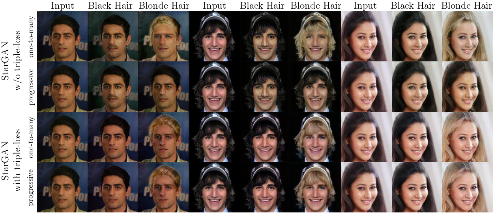

## StarGAN with a triple consistency loss

--------------------------------------------------------------------------------
This is the modified training of StarGAN using a triple consistency loss, as presented in our [preprint](https://arxiv.org/pdf/1811.03492.pdf). 

Should you use the code please cite the original StarGAN paper (of course!), as well as our pre-print. For further details on how to use the StarGAN, please refer to the [original repository](https://github.com/yunjey/stargan)

<p align="center"></p>


## Citation

```
@article{Sanchez2018Gannotation,
  title={Triple consistency loss for pairing distributions in GAN-based face synthesis},
  author={Enrique Sanchez and Michel Valstar},
  journal={arXiv preprint arXiv:1811.03492},
  year={2018}
}
```


```
@InProceedings{StarGAN2018,
author = {Choi, Yunjey and Choi, Minje and Kim, Munyoung and Ha, Jung-Woo and Kim, Sunghun and Choo, Jaegul},
title = {StarGAN: Unified Generative Adversarial Networks for Multi-Domain Image-to-Image Translation},
booktitle = {The IEEE Conference on Computer Vision and Pattern Recognition (CVPR)},
month = {June},
year = {2018}
}
```

<br/>


